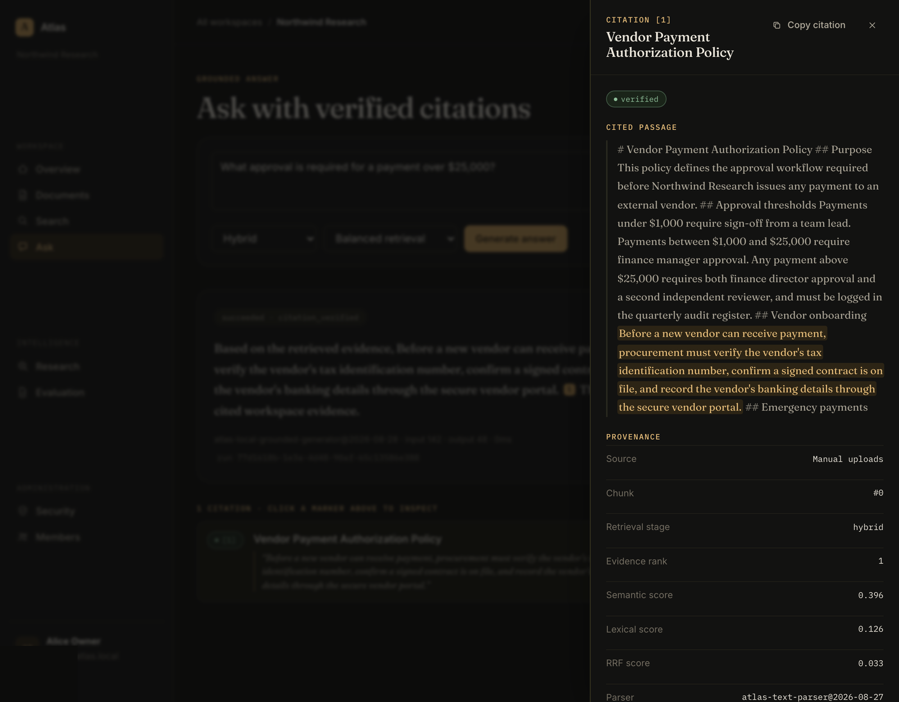
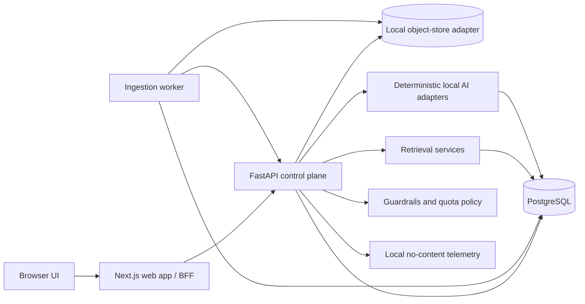
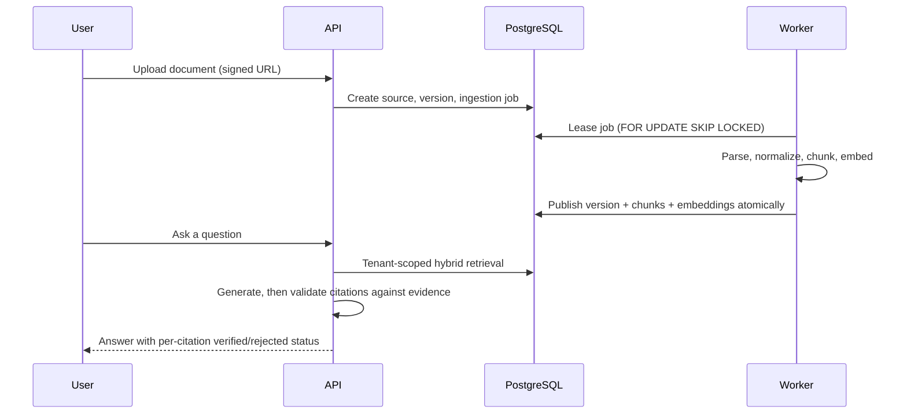
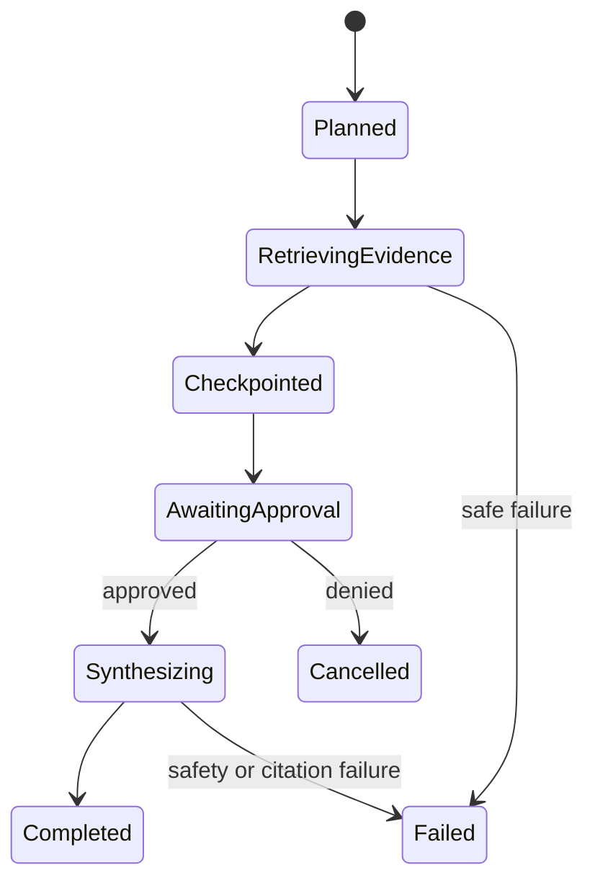
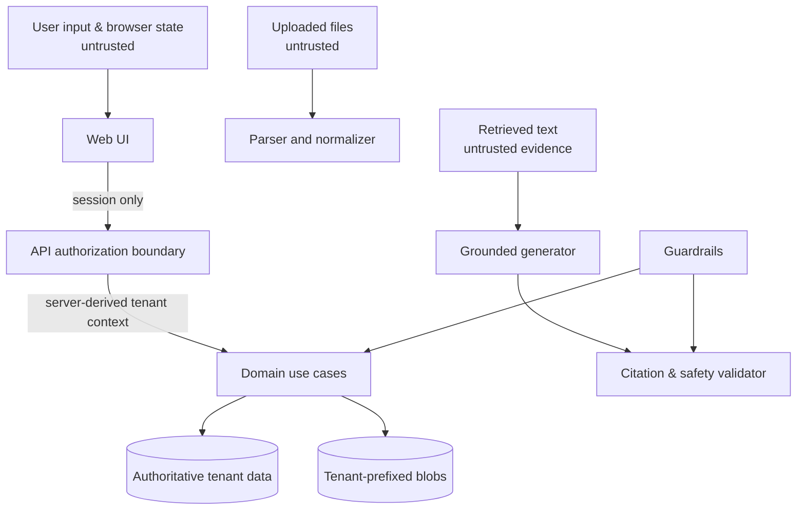

# Atlas AI

**A multi-tenant RAG and bounded-research platform where every answer carries verified evidence — and the entire thing runs for $0.**

[](https://github.com/codevoks/atlas-ai/actions/workflows/ci.yml)


Upload a document, and Atlas parses it, chunks it, embeds it, and makes it searchable — with every retrieved evidence item traceable back to a specific chunk, document version, and source. Ask a question, and the answer cites only that evidence, with citations checked *after* generation, not assumed from the model's output. Kick off a research task, and it plans bounded sub-questions, retrieves evidence, and stops for a human to approve before it synthesizes a final report.

None of this needs a paid API key. The whole golden path — ingestion, hybrid retrieval, grounded answers, bounded research, security guardrails — runs on local PostgreSQL and deterministic local AI adapters, in Docker, for free.

## Demo



A grounded answer to *"What approval is required for a payment over $25,000?"*, with its citation opened to show the exact quoted span, `verified` status, and the retrieval/parser provenance behind it — evidence rank, semantic/lexical/RRF scores, parser and chunker versions. This is a real local run against an uploaded document, not a mock.

A recorded walkthrough isn't available yet. The [Try Atlas locally](#try-atlas-locally) section below reproduces this exact state — and the rest of the golden path, including bounded research pausing at a human approval gate — against a live local instance in a handful of commands.

<!-- Demo video/GIF may be added here later. -->

## Why this exists

Most RAG demos skip the parts that make RAG hard in production: knowing *which tenant* is allowed to see *which chunk*, proving a citation actually points at retrieved text instead of a model hallucination, handling a worker crash mid-ingestion without losing or double-processing a document, and stopping a research agent before it does something irreversible. Atlas AI treats those as first-class engineering problems, not follow-up work — tenant isolation, citation verification, idempotent job state machines, and human approval gates are enforced in the code, not just described in a design doc.

## Capabilities

`Workspace tenancy & RBAC` · `Async ingestion (parse → chunk → embed)` · `Hybrid retrieval (semantic + lexical + RRF)` · `Grounded answers with post-verified citations` · `Bounded research with human approval gates` · `Prompt-injection & secret-leak guardrails` · `Offline evaluation (Recall@K, MRR, citation integrity)` · `Local no-content telemetry` · `Zero-cost deterministic demo path`

## Architecture

Next.js is the browser-facing UI/BFF and never touches the database or providers directly. FastAPI owns every authorization decision, transaction, and retrieval/RAG orchestration. The worker owns durable ingestion jobs. PostgreSQL is the single authoritative store — including the vector baseline — so there is one transaction boundary and one place tenant filters can't be forgotten.



External model/embedding/reranking providers sit behind narrow typed adapters with deterministic local fakes as the default implementation — the same interface a hosted provider would implement, so swapping one in later is a configuration change, not a rewrite.

## The RAG pipeline, end to end

A document goes through an explicit, resumable state machine — `PENDING → CLAIMED → VERIFYING → PARSING → NORMALIZING → CHUNKING → EMBEDDING → PUBLISHING → SUCCEEDED` — and nothing is searchable until it publishes atomically. Every chunk keeps its parser/chunker version and content hash; every embedding keeps its provider/model/version, so nothing gets silently compared across incompatible vector spaces.

Retrieval fuses semantic (cosine similarity) and lexical (PostgreSQL full-text) candidates with deterministic Reciprocal Rank Fusion, inside the *same* tenant/authorization filter on every branch — there's no fusion step that runs outside the access-control boundary.

Generation only ever sees the evidence retrieval handed it. After the model responds, a separate validator checks every citation marker against the supplied evidence spans — a citation is marked `verified` only if the quoted text actually resolves to an evidence item the model was given. An unverifiable claim doesn't get to look verified.



## Bounded research, with a human in the loop

Beyond single-shot Q&A, Atlas runs a bounded research workflow: it plans sub-questions, calls only two allowlisted tools (Atlas retrieval and a local policy catalog — no shell, no arbitrary HTTP), checkpoints its state, and then **stops and waits for explicit human approval** before it's allowed to synthesize a final report. Deny the approval and the run cancels; nothing gets generated without sign-off. Once approved, synthesis runs and the report cites the same evidence the run already retrieved.



There is deliberately no multi-agent runtime here — the design ledger ([`docs/decisions.md`](docs/decisions.md), D16) requires benchmark evidence that coordination overhead would actually pay off before one gets added.

## Security and trust boundaries

Tenant isolation is enforced server-side, from an authenticated membership record — never from a client-supplied workspace ID — at every retrieval branch and every mutation. Anything that crosses a trust boundary (an uploaded file, retrieved text, a tool result) is treated as **data, never as instructions**: deterministic guardrails scan high-risk input/output for indirect prompt injection, secret-like values, and SSRF-like content, and fail closed.



Every workspace exposes its own live security and operations posture — telemetry, guardrail counts, dependency status, SLO objectives — with no paid observability required to see it.

## Engineering proof, not just claims

| Concern | Atlas's approach |
|---|---|
| Tenant isolation | Server-derived membership context, checked before every use case and repository query; cross-tenant reads return a non-disclosing `404` |
| Citation integrity | Citations validated *after* generation against the exact evidence spans supplied — never inferred from model output |
| Idempotency | Upload finalization, workspace creation, and tool invocations use stable idempotency keys; ingestion jobs are leased with `FOR UPDATE SKIP LOCKED` and expected-version checks |
| Failure handling | Worker leases expire and are reclaimed; a poisoned document fails its own job without stalling the queue; permanent validation failures never auto-retry |
| Prompt injection | Deterministic scanners flag indirect-injection and secret-exfiltration patterns in uploads, queries, and research input, and fail closed |
| Reproducibility | Every embedding set, chunker, parser, and generation run records its provider/model/version, so nothing compares across incompatible configs |
| Evaluation | Versioned datasets, immutable labeled cases, and deterministic offline runs score retrieval and citation quality — not vibes |
| Deterministic testing | Every provider (embeddings, generation, reranking) has a deterministic local fake as the default implementation, not a mock bolted on for tests |

Current local validation, run in this repository:

```text
pnpm test        → 54 tests passed  (49 API · 4 worker · 1 web)
pnpm ops:validate → phase11_artifact_validation=passed, billable_provisioning=disabled, terraform_resources=0
```

Atlas's own offline evaluation harness (versioned dataset, deterministic local metrics) has recorded Recall@5 `1.0`, MRR `1.0`, and a citation-verified rate of `1.0` against its regression case set, using the same production retrieval and answer services exercised above — not a metric-only shortcut.

## Try Atlas locally

**Prerequisites:** Node.js 22+, pnpm 10.x, Python 3.12+, Docker.

```bash
pnpm install
python -m venv .venv
.venv/bin/pip install -e "apps/api[dev]" -e "apps/worker"
cp .env.example .env   # then fill in local-only random secrets — see the file for guidance
```

```bash
docker compose up -d postgres
pnpm db:migrate
pnpm --filter @atlas/api openapi && pnpm contracts
```

Start all three services (separate terminals):

```bash
pnpm --filter @atlas/api dev       # http://localhost:8000  (OpenAPI UI at /docs)
pnpm --filter @atlas/worker dev    # http://localhost:8001
pnpm --filter @atlas/web dev       # http://localhost:3000
```

Then, in the browser at `http://localhost:3000`:

1. **Sign in** with a deterministic local identity (Alice Owner / Bob Member) — no external identity provider needed in development.
2. **Create a workspace** and a source, then **upload** a `.txt` or `.md` file.
3. Trigger ingestion (the worker polls automatically, or call `POST /internal/ingestion/run-once` on the worker for an instant local demo step).
4. **Search** the workspace with hybrid retrieval, then **ask a question** and inspect the verified citation.
5. Start a **bounded research run**, watch it pause for approval, approve it, and read the cited report.

## Zero-cost, by construction

The entire path above — ingestion, embeddings, hybrid retrieval, generation, citation validation, evaluation, and bounded research — runs on local PostgreSQL and deterministic local AI adapters. No paid model API, hosted vector database, managed search, cloud object storage, or domain is required for development, testing, CI, or this demo. Hosted providers (a real LLM, Clerk-based production auth, S3, managed observability) exist as adapter-compatible, production-grade code paths, but they are opt-in and explicitly configured — never required by the default path. `infra/aws/` is plan-only Terraform: zero `resource` blocks, no cloud credentials, `enable_billable_resources = false`.

## Tech stack

- **Monorepo:** pnpm workspaces + Turborepo
- **Web:** Next.js (App Router) + Tailwind CSS
- **API:** FastAPI + SQLAlchemy (async) + Alembic, OpenAPI-first contracts
- **Worker:** Python, durable job leasing over PostgreSQL
- **Database:** PostgreSQL — transactional state, lexical (FTS) and vector (exact cosine) search in one store
- **AI adapters:** deterministic local embedding / retrieval / reranking / generation / evaluation, behind provider-neutral interfaces
- **Infra artifacts:** Dockerfiles for all three services, GitHub Actions CI, plan-only Terraform/AWS baseline

## Repository structure

```text
apps/api        FastAPI control/query plane (domain → application → infrastructure/retrieval/ai/api)
apps/worker     Durable ingestion worker
apps/web        Next.js UI / BFF
packages/       Shared TypeScript config and OpenAPI-generated types
docs/           Architecture, data model, threat model, failure model, capacity model, ADRs, diagrams
infra/aws/      Plan-only Terraform baseline (no resources, no credentials)
```

## Known limitations

This is a local-first, deterministic baseline — it proves the architecture and safety contracts, and it is explicit about what it defers rather than quietly pretending otherwise:

- The default generator, embedder, and reranker are **deterministic and local**, not a hosted frontier model — they establish a correctness and grounding baseline, not production answer quality. Hosted-provider adapters are opt-in and require their own evaluation pass.
- Ingestion supports UTF-8 text and Markdown only. PDF, Office formats, OCR, and archive handling are intentionally out of scope for the current parser boundary.
- No malware scanning, enterprise DLP/KMS/HSM, SSO/SCIM, or external penetration testing — pattern-based guardrails and PostgreSQL-enforced tenant isolation are the current line of defense.
- pgvector/ANN indexing, OpenSearch, and Redis-backed coordination are evidence-gated future decisions, not implemented — PostgreSQL exact cosine search and full-text search are the zero-cost baseline today.
- Not deployed to a live production cloud environment; `infra/aws/` documents an intended shape without provisioning it.

## Documentation

- [`docs/architecture.md`](docs/architecture.md) — system architecture and component responsibilities
- [`docs/data-model.md`](docs/data-model.md) — persistent entities and invariants
- [`docs/threat-model.md`](docs/threat-model.md) — security objectives, trust boundaries, and controls
- [`docs/failure-model.md`](docs/failure-model.md) — failure modes, retries, and recovery behavior
- [`docs/capacity-model.md`](docs/capacity-model.md) — capacity assumptions and scaling boundaries
- [`docs/decisions.md`](docs/decisions.md) — architecture decision ledger
- [`docs/system-design-visuals.md`](docs/system-design-visuals.md) — the full current diagram set
- [`docs/operations-hardening.md`](docs/operations-hardening.md) — observability, CI/container, and infrastructure posture
