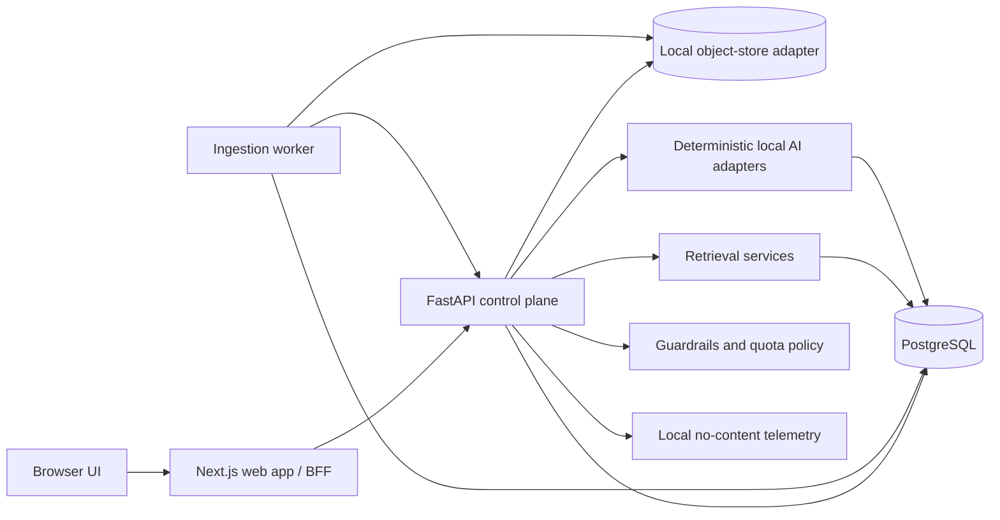
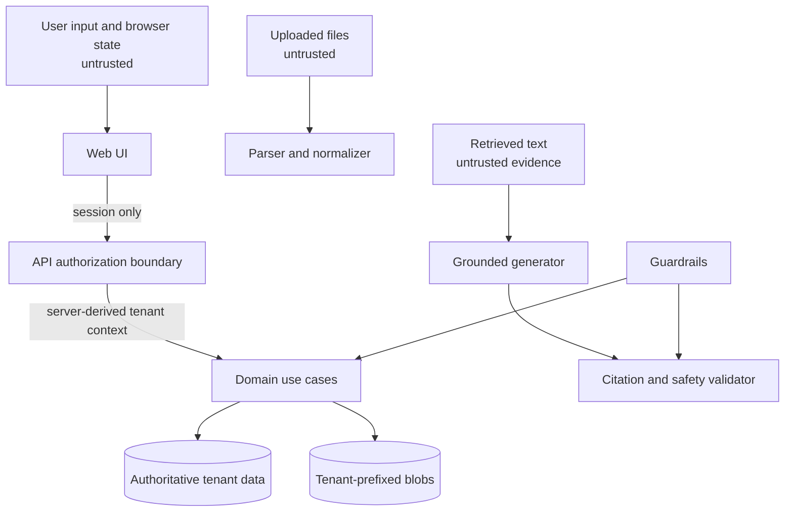
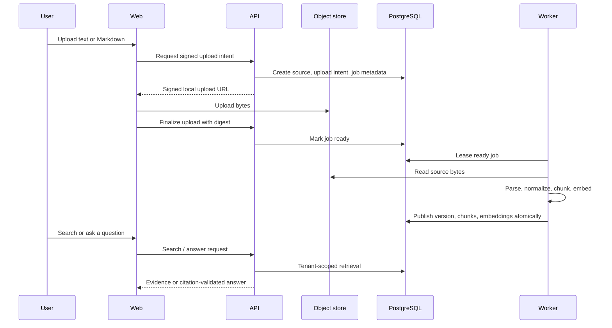
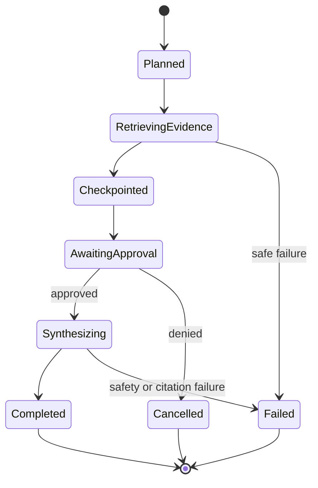
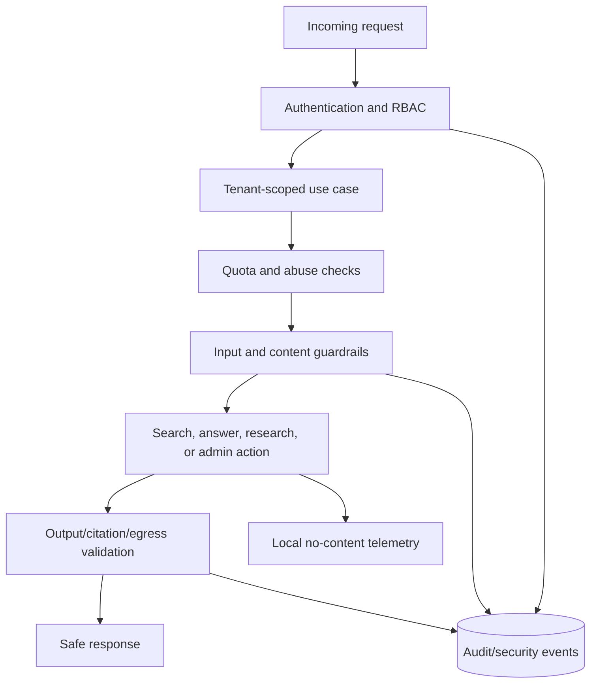

# Atlas AI system-design visuals

These diagrams describe the current product architecture and runtime flows. They are intended to help developers understand component boundaries, trust boundaries, authoritative state, and operational behavior without relying on implementation-history sequencing.

## Product architecture

## Trust and authority boundaries

## Ingestion and retrieval flow

## Grounded answer flow

```mermaid
flowchart LR
    Query[Question] --> Retrieve[Tenant-scoped hybrid retrieval]
    Retrieve --> Evidence[Typed evidence set]
    Evidence --> Context[Context builder]
    Context --> Generator[Deterministic grounded generator]
    Generator --> CitationCheck[Citation validator]
    CitationCheck --> SafetyCheck[Output guardrails]
    SafetyCheck --> Persist[Persist answer run, citations, warnings]
    Persist --> UI[Answer with verified citations]
```

## Bounded research workflow

## Security and operations controls

