# System-design visuals

These diagrams summarize the system architecture; the prose specifications remain authoritative. A boundary or flow change must update both the diagram and its owning design document.

## 1. System context, ownership, and trust boundaries

```mermaid
flowchart LR
    User[Workspace user] -->|HTTPS| Browser[Browser\nuntrusted client]
    Browser -->|session and BFF requests| Web[Next.js web and BFF]
    Web -->|service-authenticated HTTPS| API[FastAPI\ncontrol and query plane]
    Web -.->|OIDC| IdP[Identity provider]

    subgraph Atlas[Atlas service boundary]
        Web
        API
        Worker[Worker fleet\ndurable processing]
        DB[(PostgreSQL\nauthoritative state and exact vector baseline)]
        Redis[(Redis\nephemeral coordination)]
        API -->|transactions and retrieval| DB
        API -->|publish or claim durable intent| Worker
        API -->|cache and rate coordination| Redis
        Worker -->|leases, checkpoints, derived data| DB
        Worker -->|coordination only| Redis
    end

    API -->|signed operations and metadata| Objects[(Object storage\nimmutable source blobs)]
    Worker -->|stream source and artifacts| Objects
    API -->|typed generation and retrieval calls| Models[Provider adapters\nlocal fakes by default]
    Worker -->|embedding and model batches| Models
    Worker -->|isolated input| Parser[Parser sandbox\nuntrusted file boundary]
    API -->|redacted signals| Obs[OpenTelemetry\nlocal/no-export default]
    Worker -->|redacted signals| Obs

    classDef authority fill:var(--viz-series-1),color:var(--foreground),stroke:var(--border);
    classDef untrusted fill:var(--viz-series-2),color:var(--foreground),stroke:var(--border);
    classDef external fill:var(--muted),color:var(--foreground),stroke:var(--border);
    class DB authority;
    class Browser,Parser untrusted;
    class IdP,Objects,Models,Obs external;
```

The database decides tenant, membership, document publication, job, budget, and approval truth. Object storage is authoritative for blob bytes but never authorization. Redis, caches, embeddings, and later search projections must be recoverable from durable state.

## 1A. Zero-cost default execution path

```mermaid
flowchart TB
    Dev[Developer workstation] --> Web[Next.js web]
    Dev --> API[FastAPI API]
    Dev --> Worker[Worker]

    Web --> API
    API --> PG[(Local PostgreSQL)]
    Worker --> PG
    API --> FS[(Local filesystem\nobject-store adapter)]
    Worker --> FS
    API --> FakeAI[Deterministic provider fakes\nfor embeddings, generation, judges, tools]
    Worker --> FakeAI
    API --> LocalOTel[OpenTelemetry SDK\nlocal/no-export default]
    Worker --> LocalOTel

    FakeAI -. explicit opt-in only .-> PaidAI[Paid/hosted model APIs]
    FS -. explicit opt-in only .-> CloudStorage[Cloud object storage]
    LocalOTel -. explicit opt-in only .-> HostedObs[Hosted observability]

    classDef local fill:var(--viz-series-1),color:var(--foreground),stroke:var(--border);
    classDef optin fill:var(--muted),color:var(--foreground),stroke:var(--border),stroke-dasharray: 4 4;
    class Web,API,Worker,PG,FS,FakeAI,LocalOTel local;
    class PaidAI,CloudStorage,HostedObs optin;
```

The product gate runs through the local path. Optional hosted providers preserve production-grade architecture, but they are disabled by default and require explicit approval before any billable execution.

## 1B. Phase 1 implemented auth, tenancy, and RBAC slice

```mermaid
sequenceDiagram
    autonumber
    actor U as User
    participant W as Next.js web/BFF
    participant A as FastAPI API
    participant P as Policy/use cases
    participant D as PostgreSQL

    U->>W: Choose local dev identity or OIDC session
    W->>W: Store/resolve API token server-side
    W->>A: Bearer token + request ID
    A->>A: Verify issuer, audience, expiry, subject, email
    A->>D: Resolve user by issuer + subject
    U->>W: Create workspace
    W->>A: POST /v1/workspaces + Idempotency-Key
    A->>P: create_workspace(actor, name, key)
    P->>D: Transaction: idempotency lock and replay check
    P->>D: Insert workspace, owner membership, audit event, idempotency record
    A-->>W: Workspace with owner role
    U->>W: Manage members or rename workspace
    W->>A: Workspace-scoped command
    A->>P: Load active membership and require named permission
    P->>D: Tenant-scoped mutation + audit; reject last-owner loss
    A-->>W: Success or stable error envelope
```

```mermaid
flowchart LR
    Browser[Browser\nuntrusted IDs and forms]
    Web[Next.js BFF\nsession UX and typed API client]
    API[FastAPI\ncurrent actor and use cases]
    Policy[RBAC policy\nnamed permissions]
    Repo[SQLAlchemy repositories\ntenant-scoped queries]
    DB[(PostgreSQL\nusers workspaces memberships audits idempotency)]

    Browser -->|forms/navigation| Web
    Web -->|Bearer token, no-store fetch| API
    API -->|IdentityClaims -> Actor| DB
    API --> Policy
    Policy --> Repo
    Repo --> DB

    classDef untrusted fill:var(--viz-series-2),color:var(--foreground),stroke:var(--border);
    classDef trusted fill:var(--viz-series-1),color:var(--foreground),stroke:var(--border);
    class Browser untrusted;
    class API,Policy,Repo,DB trusted;
```

Phase 1 proves the control-plane boundary before any document, retrieval, or AI state exists. Browser-supplied workspace IDs never grant authority by themselves; membership lookup plus policy decides access.

## 1B. Phase 2 implemented storage and metadata-ingestion slice

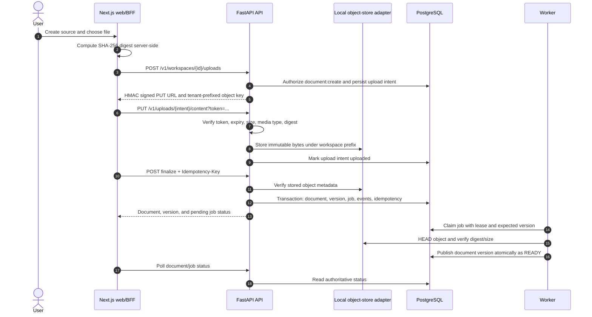

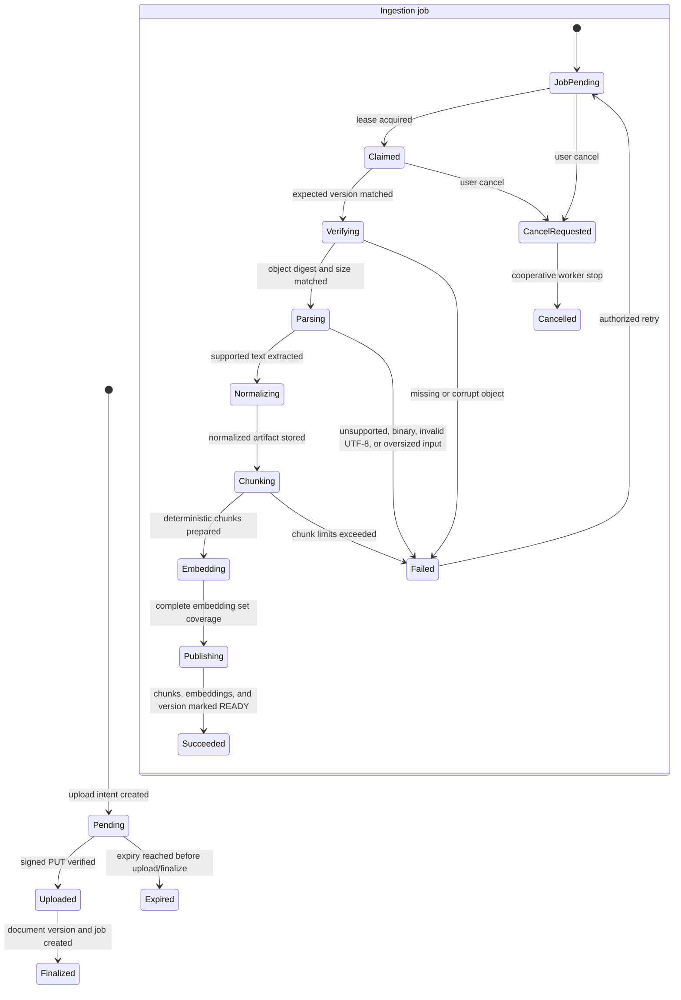

Phase 2 uses API-hosted local signed upload handling for development. The adapter boundary preserves the production design: later S3-compatible storage replaces the local adapter without changing the document or ingestion state model.

## 1C. Phase 5 implemented parsing, chunking, embedding, and hybrid retrieval slice

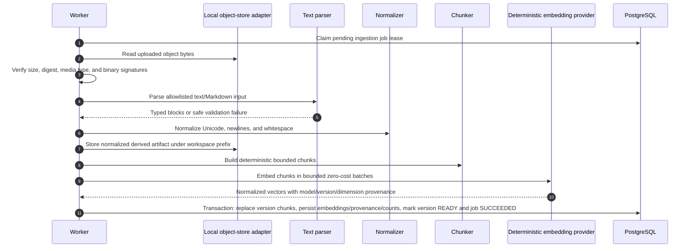

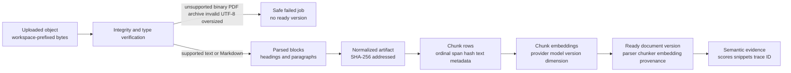

Phase 5 publishes chunks and embeddings only inside the final database transaction. Partial parser/chunker/embedding output is never visible as a ready document version. Semantic, lexical, and hybrid search return evidence only; answer generation remains deferred.

## 1D. Phase 5 hybrid retrieval flow

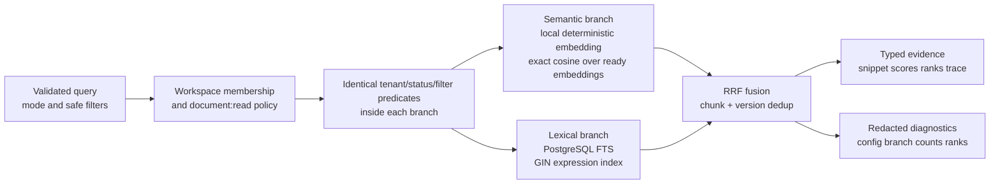

Hybrid retrieval keeps lexical and semantic candidate generation as separate ranked lists, then fuses ranks with RRF rather than mixing raw branch scores. This makes exact-term/entity matches and semantic paraphrase matches visible through one deterministic evidence API while preserving branch provenance for debugging.

## 1E. Phase 6 grounded answer and citation validation flow

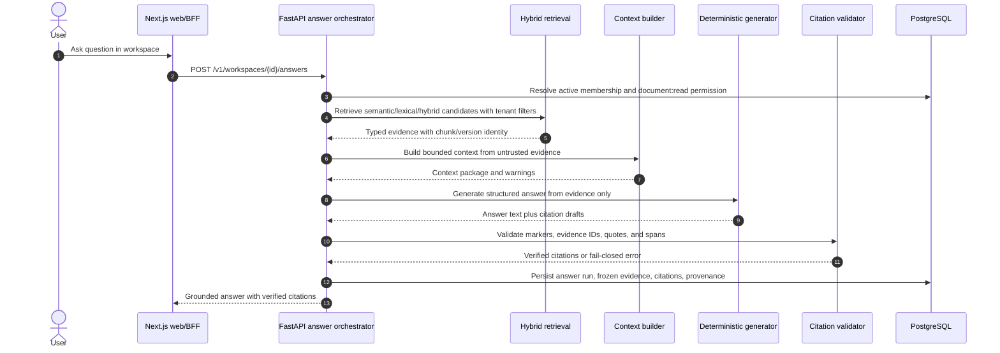

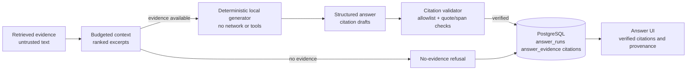

Phase 6 proves the answer/citation integrity boundary before introducing hosted LLMs, streaming, tools, or agentic workflows. Prompts remain implementation details; authorization and citation truth come from typed evidence and persisted validation.

## 2. Durable ingestion and atomic publication

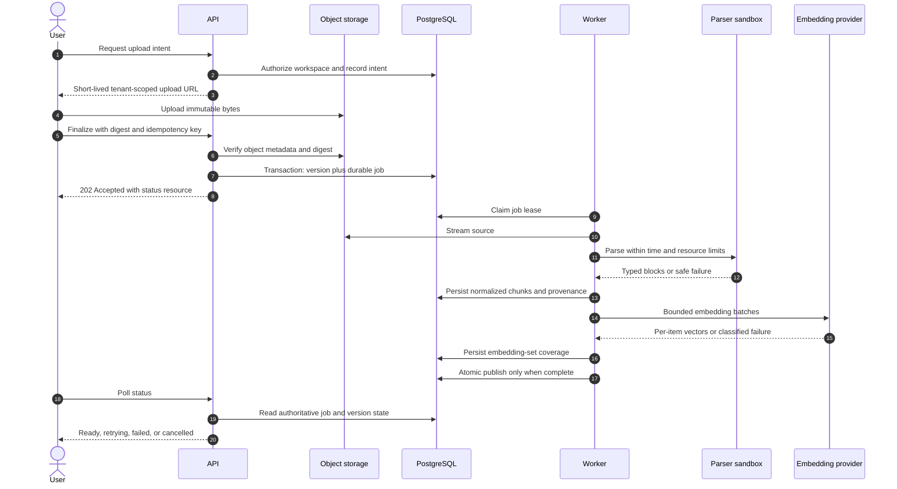

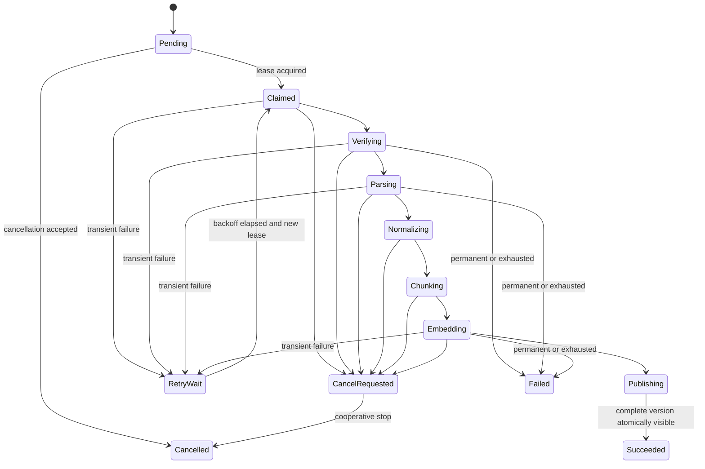

## 3. Retrieval, grounded generation, and citation integrity

```mermaid
flowchart LR
    Q[User query and typed filters] --> Auth[Authenticate, authorize,\nrate and budget check]
    Auth --> Spec[Workspace-scoped QuerySpec]
    Spec --> S[Semantic candidates\nPostgreSQL exact cosine baseline]
    Spec --> L[Lexical candidates\nPostgreSQL FTS]
    S --> F[RRF fusion and dedup]
    L --> F
    F --> R[Optional reranking]
    R --> C[Context builder\ntoken, diversity, provenance]
    C --> E[Typed immutable Evidence]
    E --> G[Structured generation\nevidence is untrusted data]
    G --> V[Schema, policy, citation ID\nand span validation]
    E --> V
    V -->|valid| A[Grounded answer\nwith resolvable citations]
    V -->|invalid or dependency failure| D[Safe degraded result\nor explicit failure]

    classDef trusted fill:var(--viz-series-1),color:var(--foreground),stroke:var(--border);
    classDef untrusted fill:var(--viz-series-2),color:var(--foreground),stroke:var(--border);
    class Auth,Spec,V trusted;
    class Q,E,G untrusted;
```

Authorization predicates execute inside every retrieval branch. A model never invents an acceptable evidence identity: validation compares its claims only with the exact evidence supplied to the run.

## 4. Immutable lineage and safe migrations

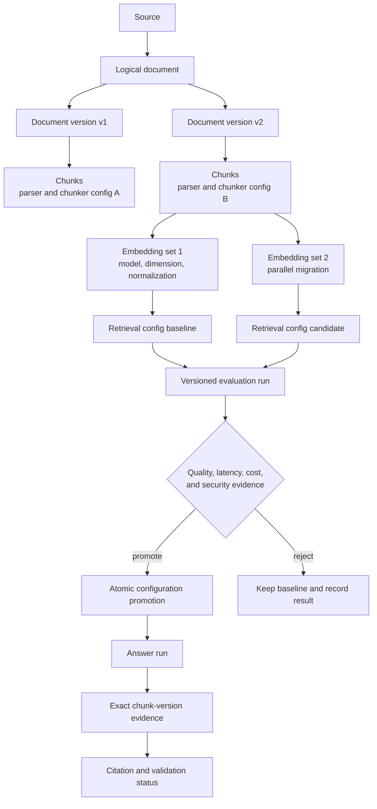

Old content, vectors, and configurations coexist during migrations. Evaluation precedes promotion, and rollback remains possible until retention deliberately removes superseded derived data.

## 5. Phase 7 deterministic evaluation run

```mermaid
flowchart TB
    User[Authorized workspace member] --> API[Evaluation API]
    API --> Auth[RBAC and tenant checks]
    Auth --> Dataset[(evaluation_datasets)]
    Auth --> Version[(immutable dataset version)]
    Version --> Cases[(labeled evaluation_cases)]
    Cases --> LabelCheck[Validate relevant chunk IDs\nready, active, same workspace]
    LabelCheck --> Run[(evaluation_runs\nconfig + code revision)]
    Run --> SUT[System under test\nproduction retrieval + answer services]
    SUT --> Search[Semantic, lexical, or hybrid retrieval]
    Search --> Answer[Grounded answer + citation validator]
    Answer --> Metrics[Deterministic local metrics\nRecall, Precision, MRR, NDCG,\nanswer/citation coverage]
    Cases --> Metrics
    Metrics --> Results[(evaluation_results)]
    Results --> Aggregate[Aggregate, slice,\nand failure summaries]
    Aggregate --> Run
    Run --> Baseline[(append-only baseline approval)]

    classDef trusted fill:var(--viz-series-1),color:var(--foreground),stroke:var(--border);
    classDef labels fill:var(--viz-series-4),color:var(--foreground),stroke:var(--border);
    classDef untrusted fill:var(--viz-series-2),color:var(--foreground),stroke:var(--border);
    class API,Auth,LabelCheck,Metrics trusted;
    class Dataset,Version,Cases labels;
    class SUT,Search,Answer untrusted;
```

Expected labels are intentionally separated from the production retrieval and answer path. They are consumed only by the metric layer after the system-under-test has produced outputs, which prevents expected-answer leakage and keeps evaluation evidence meaningful.

## 6. Phase 8 evidence-gated query expansion

```mermaid
flowchart TB
    Client[Search, answer, or evaluation request] --> Config{Retrieval config}
    Config -->|phase5 baseline| Original[Original query only]
    Config -->|phase8 candidate| Transform[Deterministic query transformer]
    Transform --> Guard{Injection-like text?}
    Guard -->|yes| Original
    Guard -->|no| Variants[Bounded query variants\nmax 3]
    Original --> Plan[Retrieval plan executor]
    Variants --> Plan
    Plan --> Budget[Fan-out budget\nmax 6 branch queries]
    Budget --> Sem[Semantic branches\nsame tenant filters]
    Budget --> Lex[Lexical branches\nsame tenant filters]
    Sem --> Aggregate[Dedup + RRF/best-score\n+ optional diversity]
    Lex --> Aggregate
    Aggregate --> Evidence[Typed evidence\nwith query-variant provenance]
    Evidence --> Answer[Grounded answer\nor evaluation metrics]
    Evidence --> Ablation[Phase 7 evaluation run\nbaseline vs candidate]
    Ablation --> Decision{Measured slice benefit\nwithout unsafe tradeoff?}
    Decision -->|yes| Keep[Config remains enabled]
    Decision -->|no| Rollback[Use baseline config]

    classDef trusted fill:var(--viz-series-1),color:var(--foreground),stroke:var(--border);
    classDef untrusted fill:var(--viz-series-2),color:var(--foreground),stroke:var(--border);
    class Config,Transform,Guard,Plan,Budget,Aggregate,Decision trusted;
    class Client,Sem,Lex,Evidence,Answer,Ablation untrusted;
```

The Phase 8 transformer changes only query text used for candidate generation. It does not change workspace membership, source/document filters, citation validation, or generation policy. The baseline configuration remains available for rollback and comparison.

## 7. Phase 9 bounded research workflow

```mermaid
flowchart TB
    User[Authorized workspace member] --> API[Research API]
    API --> Auth[RBAC and tenant checks]
    Auth --> Run[(research_runs)]
    Run --> Plan[Planner node\nbounded subquestions]
    Plan --> Step1[(research_steps)]
    Plan --> Budget[Budget ledger\nsteps, tools, tokens, cost]
    Budget --> ToolPolicy{Tool policy}
    ToolPolicy -->|allowlisted| Retrieval[atlas_retrieval tool\nPhase 8 search service]
    ToolPolicy -->|allowlisted| Catalog[local_policy_catalog tool]
    ToolPolicy -->|forbidden URL/tool/prompt| Reject[Validation failure\nno tool execution]
    Retrieval --> ToolRows[(tool_invocations)]
    Catalog --> ToolRows
    Retrieval --> Evidence[Workspace evidence\nchunk/version provenance]
    Catalog --> Evidence
    Evidence --> Checkpoint[(checkpoints\nschema-versioned state)]
    Checkpoint --> Approval[(approvals\npending)]
    Approval -->|deny| Cancelled[research_runs.cancelled]
    Approval -->|approve current version| Synthesis[Synthesis node\ncited report]
    Synthesis --> Report[research_runs.succeeded\nreport + evidence]
    Checkpoint -->|resume| Plan

    classDef trusted fill:var(--viz-series-1),color:var(--foreground),stroke:var(--border);
    classDef untrusted fill:var(--viz-series-2),color:var(--foreground),stroke:var(--border);
    class API,Auth,Budget,ToolPolicy,Approval,Synthesis trusted;
    class User,Retrieval,Catalog,Evidence untrusted;
```

Phase 9 deliberately implements a single bounded workflow rather than a general autonomous assistant. The default graph uses deterministic local tools and pauses before final synthesis so evidence and tool provenance can be inspected before a report is produced.

## 8. Evidence-driven scale evolution

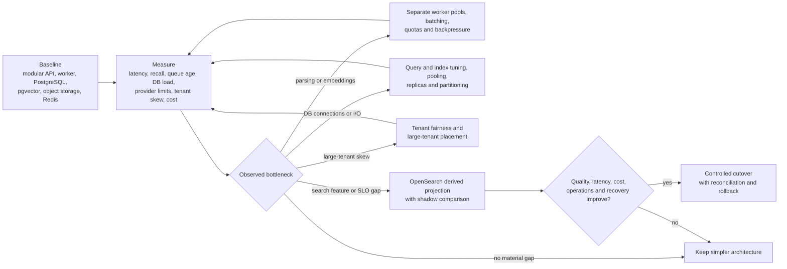

Scale decisions follow the constrained resource. “Ten million documents” alone does not select an engine; tenant distribution, filters, freshness, query mix, availability, cost, and operational skill determine the design.
