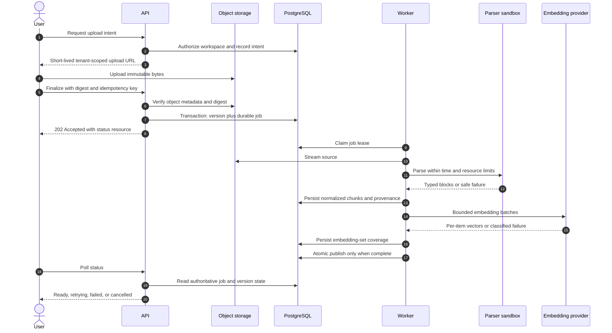
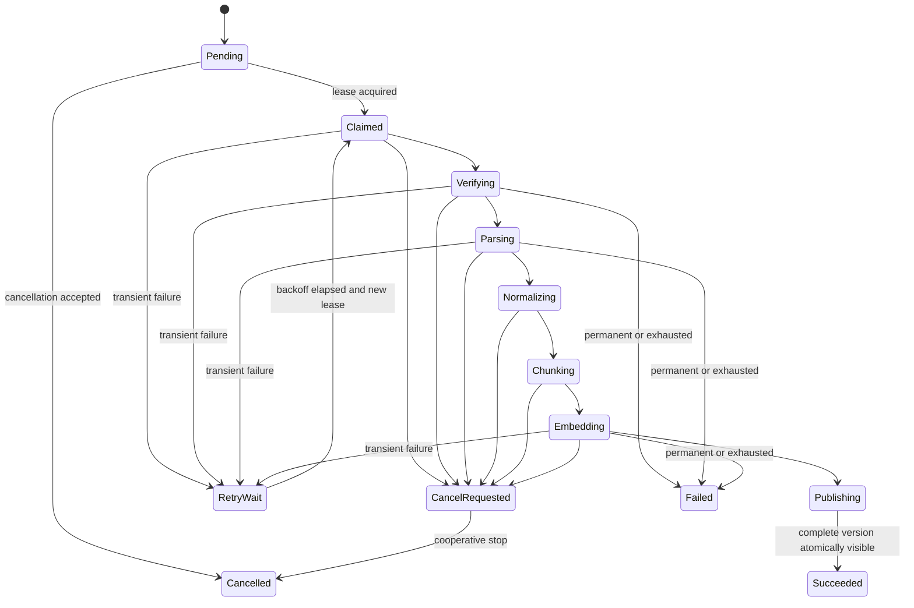
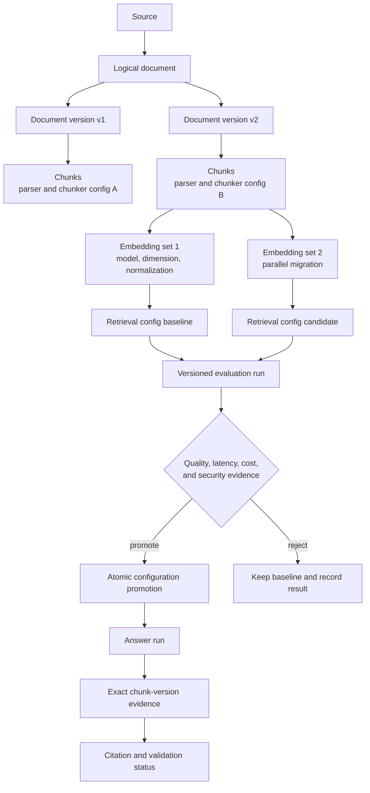
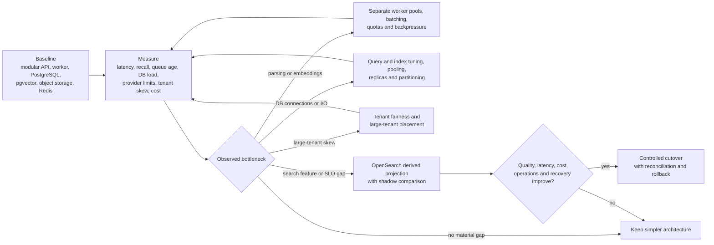

# System-design visuals

These diagrams summarize the system architecture; the prose specifications remain authoritative. A boundary or flow change must update both the diagram and its owning design document.

## 1. System context, ownership, and trust boundaries

```mermaid
flowchart LR
    User[Workspace user] -->|HTTPS| Browser[Browser\nuntrusted client]
    Browser -->|session and BFF requests| Web[Next.js web and BFF]
    Web -->|service-authenticated HTTPS| API[FastAPI\ncontrol and query plane]
    Web -.->|OIDC| IdP[Identity provider]

    subgraph Atlas[Atlas service boundary]
        Web
        API
        Worker[Worker fleet\ndurable processing]
        DB[(PostgreSQL and pgvector\nauthoritative state)]
        Redis[(Redis\nephemeral coordination)]
        API -->|transactions and retrieval| DB
        API -->|publish or claim durable intent| Worker
        API -->|cache and rate coordination| Redis
        Worker -->|leases, checkpoints, derived data| DB
        Worker -->|coordination only| Redis
    end

    API -->|signed operations and metadata| Objects[(Object storage\nimmutable source blobs)]
    Worker -->|stream source and artifacts| Objects
    API -->|typed generation and retrieval calls| Models[External AI providers]
    Worker -->|embedding and model batches| Models
    Worker -->|isolated input| Parser[Parser sandbox\nuntrusted file boundary]
    API -->|redacted signals| Obs[OpenTelemetry and Langfuse]
    Worker -->|redacted signals| Obs

    classDef authority fill:var(--viz-series-1),color:var(--foreground),stroke:var(--border);
    classDef untrusted fill:var(--viz-series-2),color:var(--foreground),stroke:var(--border);
    classDef external fill:var(--muted),color:var(--foreground),stroke:var(--border);
    class DB authority;
    class Browser,Parser untrusted;
    class IdP,Objects,Models,Obs external;
```

The database decides tenant, membership, document publication, job, budget, and approval truth. Object storage is authoritative for blob bytes but never authorization. Redis, caches, embeddings, and later search projections must be recoverable from durable state.

## 1A. Phase 1 implemented auth, tenancy, and RBAC slice

```mermaid
sequenceDiagram
    autonumber
    actor U as User
    participant W as Next.js web/BFF
    participant A as FastAPI API
    participant P as Policy/use cases
    participant D as PostgreSQL

    U->>W: Choose local dev identity or OIDC session
    W->>W: Store/resolve API token server-side
    W->>A: Bearer token + request ID
    A->>A: Verify issuer, audience, expiry, subject, email
    A->>D: Resolve user by issuer + subject
    U->>W: Create workspace
    W->>A: POST /v1/workspaces + Idempotency-Key
    A->>P: create_workspace(actor, name, key)
    P->>D: Transaction: idempotency lock and replay check
    P->>D: Insert workspace, owner membership, audit event, idempotency record
    A-->>W: Workspace with owner role
    U->>W: Manage members or rename workspace
    W->>A: Workspace-scoped command
    A->>P: Load active membership and require named permission
    P->>D: Tenant-scoped mutation + audit; reject last-owner loss
    A-->>W: Success or stable error envelope
```

```mermaid
flowchart LR
    Browser[Browser\nuntrusted IDs and forms]
    Web[Next.js BFF\nsession UX and typed API client]
    API[FastAPI\ncurrent actor and use cases]
    Policy[RBAC policy\nnamed permissions]
    Repo[SQLAlchemy repositories\ntenant-scoped queries]
    DB[(PostgreSQL\nusers workspaces memberships audits idempotency)]

    Browser -->|forms/navigation| Web
    Web -->|Bearer token, no-store fetch| API
    API -->|IdentityClaims -> Actor| DB
    API --> Policy
    Policy --> Repo
    Repo --> DB

    classDef untrusted fill:var(--viz-series-2),color:var(--foreground),stroke:var(--border);
    classDef trusted fill:var(--viz-series-1),color:var(--foreground),stroke:var(--border);
    class Browser untrusted;
    class API,Policy,Repo,DB trusted;
```

Phase 1 proves the control-plane boundary before any document, retrieval, or AI state exists. Browser-supplied workspace IDs never grant authority by themselves; membership lookup plus policy decides access.

## 2. Durable ingestion and atomic publication





## 3. Retrieval, grounded generation, and citation integrity

```mermaid
flowchart LR
    Q[User query and typed filters] --> Auth[Authenticate, authorize,\nrate and budget check]
    Auth --> Spec[Workspace-scoped QuerySpec]
    Spec --> S[Semantic candidates\npgvector]
    Spec --> L[Lexical candidates\nPostgreSQL FTS]
    S --> F[RRF fusion and dedup]
    L --> F
    F --> R[Optional reranking]
    R --> C[Context builder\ntoken, diversity, provenance]
    C --> E[Typed immutable Evidence]
    E --> G[Structured generation\nevidence is untrusted data]
    G --> V[Schema, policy, citation ID\nand span validation]
    E --> V
    V -->|valid| A[Grounded answer\nwith resolvable citations]
    V -->|invalid or dependency failure| D[Safe degraded result\nor explicit failure]

    classDef trusted fill:var(--viz-series-1),color:var(--foreground),stroke:var(--border);
    classDef untrusted fill:var(--viz-series-2),color:var(--foreground),stroke:var(--border);
    class Auth,Spec,V trusted;
    class Q,E,G untrusted;
```

Authorization predicates execute inside every retrieval branch. A model never invents an acceptable evidence identity: validation compares its claims only with the exact evidence supplied to the run.

## 4. Immutable lineage and safe migrations



Old content, vectors, and configurations coexist during migrations. Evaluation precedes promotion, and rollback remains possible until retention deliberately removes superseded derived data.

## 5. Evidence-driven scale evolution



Scale decisions follow the constrained resource. “Ten million documents” alone does not select an engine; tenant distribution, filters, freshness, query mix, availability, cost, and operational skill determine the design.
